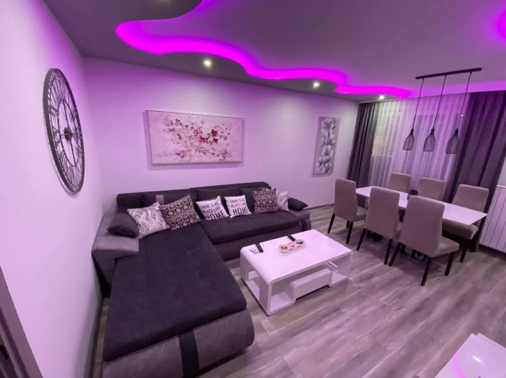
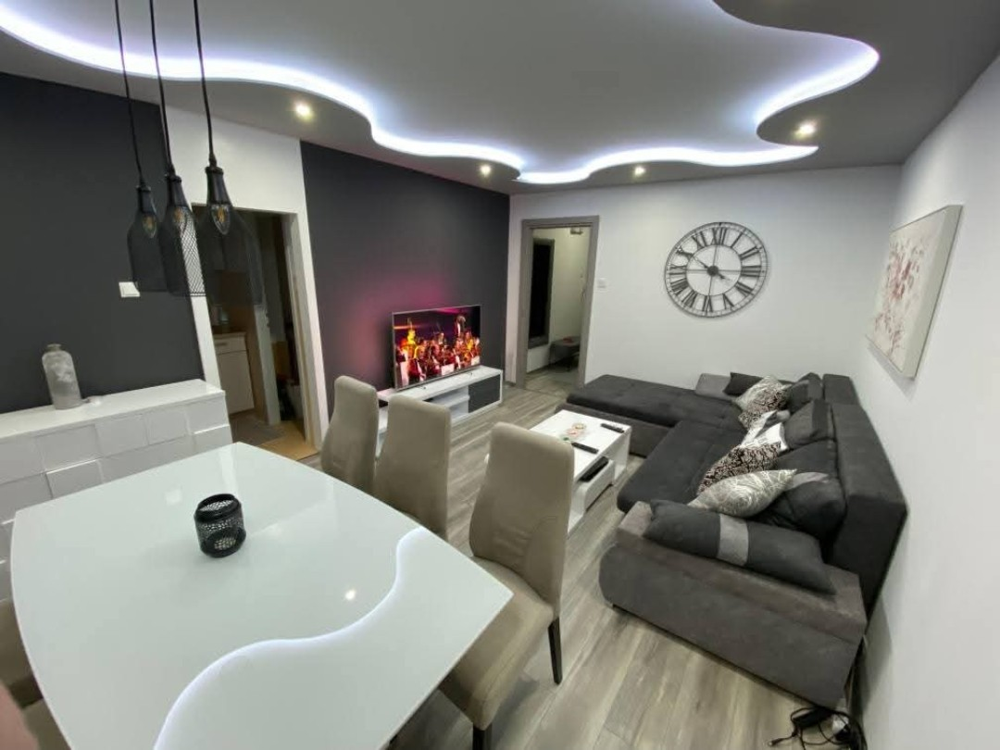
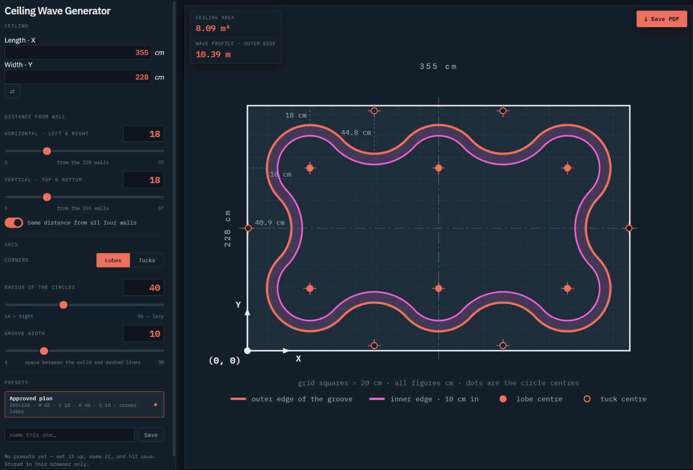

# Ceiling Wave Generator

Plan and print a wavy LED ceiling.

<p>
  
  
</p>

Enter room size and wall distance, pick curve size, get wave ceiling plan with every circle centre measured. Live plan on screen, one-page A4 PDF for the ladder.

Live app: https://claude.ai/artifact/3LGSk477h8fAav6S9uJmQh



---

## What you get

- **A live plan of your ceiling** with the wavy lit groove drawn to scale on a 20 cm grid.
- **Every circle centre measured** from the bottom-left corner of the room. Hover or tap a dot to see its exact `(x, y)`.
- **Ceiling area** and **wave profile length** (how much LED profile to buy) in the card at the top-left of the plan.
- **Key distances** marked on the plan: the gap to the wall and how deep each inward curve reaches.
- **A one-page A4 PDF** with the plan, the grid and every centre labelled, ready to print and take up the ladder.

## How to use it

1. **Ceiling:** enter the room's length (X) and width (Y) in cm. The ⇄ button swaps them.
2. **Distance from wall:** set how far the wave stays from the walls. Keep *Same distance from all four walls* on for an even border, or turn it off to set the long and short walls separately.
3. **Corners:** choose **Lobes** (the wave bulges into the corners, which is the default) or **Tucks** (the wave curves in at the corners).
4. **Radius of the circles:** smaller circles give a tighter wave with more curves, larger ones a lazier wave.
5. **Groove width:** the width of the lit channel, 10 cm by default.
6. **Save PDF** (top-right) downloads the printable plan.

If a combination doesn't fit the room, the app adjusts the radius first. It only changes the wall distance if no radius works.

**Presets:** name your setup and press **Save** to come back to it later. **Approved plan** is always there as a starting point. Presets and your last settings are stored in this browser only.

## Building it on site

1. Mark the origin in the **bottom-left corner** of the room: X runs along the length wall, Y up the width wall.
2. Mark each circle centre from the PDF, measuring X and Y from the origin.
3. From each centre, swing the arc with a batten drilled at the radius shown on the sheet.
4. **Quick check:** neighbouring centres are always exactly **2 × radius** apart. If they are, the wave closes smoothly with no kinks.

- **Solid line:** outer edge of the groove.
- **Dashed line:** inner edge.
- **Filled dot:** centre of a curve bulging towards the wall.
- **Hollow dot:** centre of a curve pulling into the room.

## Running it locally

No install needed. Open `index.html` in a browser, or serve the folder so presets are saved reliably:

```sh
python -m http.server 8080
# then open http://localhost:8080
```

Developer notes (geometry, rules, testing) live in the comments at the top of `app.js`.
